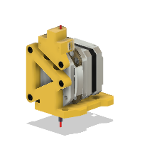

# SREVA1 BOM

|Image|Name|Number|Description|Quantity|
|-|-|-|-|-|
||Disc Magnet 6x3 v3:2|Disc Magnet 6x3||2|
||Filament Runout Sensor for OMG:1|Filament Runout Sensor for OMG||1|
||Hall Sensor AH3364Q v6:1|Hall Sensor AH3364Q|Affiliate Link: https://amzn.to/424WQ1N|1|
||M2 Washer v2:1|M2 Washer||1|
||M2x8 BHCS Self Tapping v3:1|M2x8 Self-tapping Screw||2|
||M3x10 SHCS v3:1|M3x10 SHCS||2|
||M3x25 SHCS v2:1|M3x25 SHCS||3|
||M3x5x4 Threaded Insert v2:1|M3x5x4 Threaded Insert||2|
||M3x8 SHCS v2:1|M3x8 SHCS||1|
||OMG V2S v28:1|OMG V2S||1|
||SR EVA Bottom:1|SR EVA Bottom||1|
||SR EVA Front:1|SR EVA Front||1|