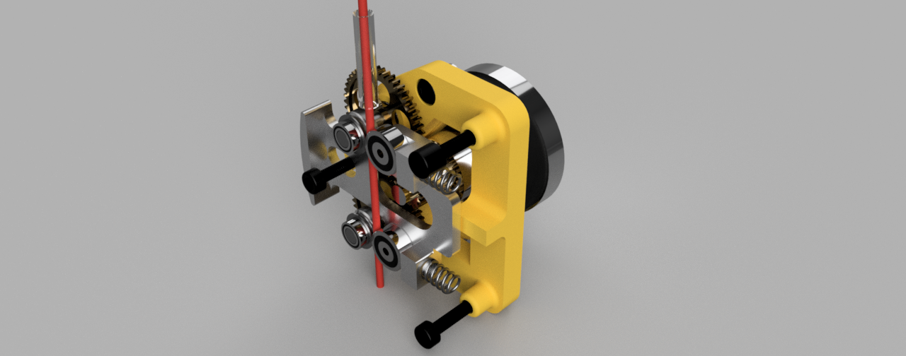

# Steamroller Stealthburner BOM

|Image|Number|Quantity|Description|
|-|-|-|-|
||Cable Cover PCB|1|From the Voron Clockwork 2: [https://github.com/VoronDesign/Voron-Stealthburner/tree/main/STLs/Clockwork2](https://github.com/VoronDesign/Voron-Stealthburner/tree/main/STLs/Clockwork2)|
||Chain Anchor (3 Hole)|1|From Voron Clockwork 2: [https://github.com/VoronDesign/Voron-Stealthburner/tree/main/STLs/Clockwork2](https://github.com/VoronDesign/Voron-Stealthburner/tree/main/STLs/Clockwork2)|
||M3x10 SHCS|1||
||M3x16 SHCS|2||
||M3x5x4 Threaded Insert|11||
||M3x6 SHCS|1||
||OMG V2S|1|Affiliate Link: [https://amzn.to/48pWOVK](https://amzn.to/48pWOVK)|
||SR SB Back|1||
||SR SB Front|1||